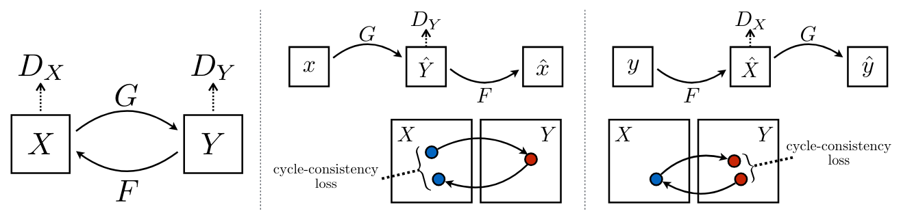

# Point Cloud Colorization using Image-to-Image Translation

## Models
- Pix2Pix Unet
- Pix2Pix ResNet
- CycleGAN Resnet
- Progressive Growing of GANs

## Dataset
[Melbourne 3D Data](https://data.melbourne.vic.gov.au/explore/dataset/city-of-melbourne-3d-point-cloud-2018/)

[Estonia](https://geoportaal.maaamet.ee/eng/Maps-and-Data/Elevation-data/Download-Elevation-Data-p664.html)
