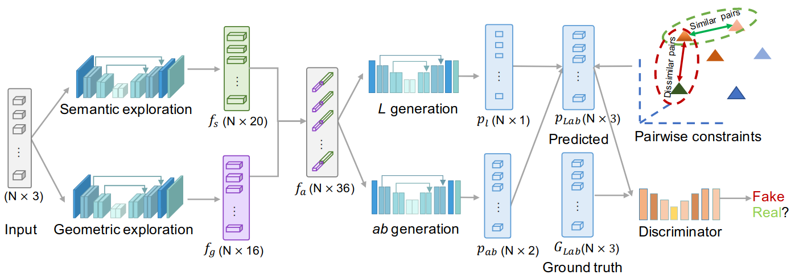

## Keywords
Scene-level, Point Cloud Colorization, Semantics, Geometry, SGNet, Colourfulness Metric Loss, Pairwise Consistency Loss, Lab Color Space, ScanNet Dataset
## Novelty
Semantics-and-geometry-aware colorization network (SGNet). This pipeline explores geometric and semantic cues from point clouds containing only coordinates for colour prediction. It also proposes two novel losses, including a *colourfulness metric loss* and a *pairwise consistency loss*, to constrain model training for genuine colourisation.
## Approach
The paper proposes a pipeline that extracts the geometric and semantic cues from point clouds, based on the semantics or types of objects or regions using SGNet which is a sparse fully convolutional network. It introduces two novel constraints, colourfulness metric which enforces the model to produce visually vibrant colours and pairwise consistency, to constrain the uniformity between the ground truth and predictions.
## Models
**Semantics-and-geometry-aware Network**
The paper argues that that point cloud colourisation potentially implies a requirement for scene understanding of point clouds. The authors observed that the colour information can be inferred from **scene semantic information** (*i.e.*, recognised objects and regions) and **scene geometric information** (*i.e.*, local spatial cues). Two backbone networks are utilised for the generator to learn discriminating point-wise features that describe the raw point clouds from both geometric and semantic perspectives.

***Geometric exploration***
[FCGF](https://openaccess.thecvf.com/content_ICCV_2019/papers/Choy_Fully_Convolutional_Geometric_Features_ICCV_2019_paper.pdf) (Fully-Convolutional Geometric Feature) model, previously introduced on 3D geometric matching, was used to extract the sparse geometric features $f_g \in \mathcal{R}^{N \times 16}$. This model has a big receptive field and can extract broad contextual information.

***Semantic exploration***
Besides, MinkowskiNet, which is a 4D convolutional neural network with generalised sparse convolutions, was adopted to learn semantic feature representation $f_s \in \mathcal{R}^{N \times 20}$.

The geometric cues provide local structure information to facilitate the preservation of fine structures in colorization. The semantic cues can benefit object/region recognition. The $f_a \in \mathcal{R}^{N \times 36}$ feature vector is used to further colour semantics in LAB colour space. The reason why LAB is preferred is because it is designed to approximate human vision and thus represent colour information better in the physical world.

Considering that lightness ($L$) and chromaticity ($a$ and $b$) are independent in LAB colours space, the aggregated feature vector $f_a$ is fed into two different U-Net like models with skip connections and residual blocks are used to predict the Lab colours.

## Loss functions
Forces the model to learn authentic colours with a broad colour distribution

**Colourfulness metric loss**
Compare the colour distribution of the colourised point cloud and the ground truth point cloud, difference of the colour histogram, defined as
$l_{cm} = (6 dist_L + dist_a + dist_b) / 8$
where $dist_x$ is the KL-divergence of the histograms for channels $x \in \{L, a, b\}$ between the prediction and the ground truth. The luminance channel correlates with human perception of colour, and the weight of $dist_L$ is larger, because human eyes can capture subtler colour changes of $L$ channels.

**Pairwise consistency loss**
Forces the model to be consistent with ground truth
The made assumption is that the pair of points that share similar colours on the ground truth, should maintain them for the predicted points and vice versa. To put it differently, there shouldn’t be any similar points in ground truth that are not similar between each other in the prediction. It can be represented as:

$l_{con}  = \sum\limits_{i, j \in \mathbb{S}, i ≠ j} e^{-\frac{\|g_i - g_j\|)}{\lambda}}\|p_i - p_j\|$

where $p_i$ and $g_i$ are the predicted and ground truth colour at point $i$, and $\lambda$ is a hyperparameter

<aside>
💡 In the pairwise consistency loss if you increase the number of similar pairs you compare, based on the assumption that similar coloured point would be closer to each other, you will get better results on the colourisation of bigger objects, but it will suffer on differentiating between smaller objects and regions where sharp changes of colour occur. What what we can try here is while performing the random selection of points, to take into consideration the Euclidean distance (geometrical, not colour) of the point clouds, assuming that closer point clouds have the same colour.

</aside>

**Smoothed L1 loss and adversarial loss**
Smoothed L1 $l_s$ is used to make the network more robust to outliers and avoid the gradient explosion during the training process.

The adversarial loss $l_g$ for the generator is the default for fooling the discriminator.

The total loss
$\mathcal{L} = l_g + \alpha l_s + \beta l_{cm} + \sigma l_{con}$

In the paper the hyperparameters were set set $\alpha$ = 5, $\beta$ = 0.1, and $\sigma$ = 0.001 in all experiments.
## Dataset
For the experiments, ScanNet dataset was used, which consists of 1,513 scans covering 20 object categories from 707 unique indoor environments. It contains RGB-D scenes, represented as a point cloud.
## Results
**Quantitative Evaluation**

**Mean Square Error (MSE)** - mean difference between the predicted and ground truth colour

**Frèchet point cloud distance (FPD)** - 2-Wasserstein distance between predicted and ground truth Gaussian measure in feature spaces

**Colourfulness metric (CM)** - histogram-based metric that measures how realistic the resulting colour distribution is close to the ground truth

compared to DensePointNet as baseline
Adam optimiser with learning rate to 5e-5 and 1e-4 for the generator and discriminator
The model is trained for 80 epochs with a batch size of 12 on NVIDIA 2080Ti GPUs

**Qualitative Evaluation**
more vibrant and realistic colours credited to loss constraints
objects in the scene are differentiated and coloured with clear object structure credited to semantic and geometric cues
## Ablation study
**Effectiveness of input features**
Compared with the geometric feature input, the semantic feature exhibits relatively slightly better colorization performance, which may stem from mining semantic clues of the scene. However, combining both gives more encoding information.
It can be seen that the geometric version well preserves the object structure of the scene (e.g., the chair on the right), and the semantic version considers the semantic differences of objects/regions for colorization (e.g., the monitor and walls).

**Effectiveness of loss terms**
Compared to the baseline of using L1 smoothed and adversarial loss, adding the colourfulness metric forces the model to produce more colourful colours with wider colour distribution gives the best results on CM.
The consistency loss achieves good performance on MSE and FPD. As the consistency loss strengthens the inner smoothness of the same object degrades the colourfulness of the final result.
It can be concluded that a realistic colorization result should be a balance between the object semantics consistency and colourfulness.
## Links